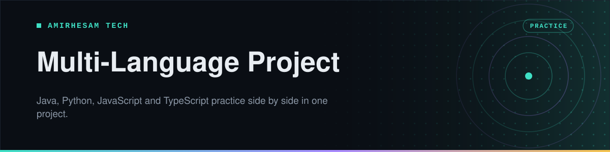

<p align="center">
  
</p>

<p align="center">
  
  
  
  
  
  <a href="https://github.com/amirh3sam/Multi_Language_Project/stargazers"></a>
</p>

<p align="center">
  <a href="#quick-start"><b>Quick start</b></a> ·
  <a href="#the-same-task-in-four-languages">Same task, four languages</a> ·
  <a href="#whats-in-each-language">What is in each</a> ·
  <a href="#setting-up-your-ide">IDE setup</a> ·
  <a href="#faq">FAQ</a>
</p>

Learning a second programming language is mostly learning that you already know the ideas. A loop is a loop. The syntax changes, the thinking does not.

This project makes that visible. The same set of small problems is solved in **Java, Python, JavaScript and TypeScript**, in one repository, so you can open two files side by side and see exactly where the languages agree and where they go their own way.

- **Nine tasks solved in every language**, from swapping two variables to finding a median.
- **Theory files per language**, covering the basics each one does differently: printing, loops, collections, classes, exceptions.
- **One project, four runtimes.** Set it up once and you can run any of them.

## Quick start

```bash
git clone https://github.com/amirh3sam/Multi_Language_Project.git
```

Each language runs on its own. You do not need all four installed to use one.

```bash
# Python
python python/tasks/median_number.py

# JavaScript
node src/JavaScript/tasks/MedianNumber.js

# TypeScript
npx tsc src/TypeScript/MedianNumber.ts && node src/TypeScript/MedianNumber.js
```

For Java, open the project in IntelliJ IDEA and run any class with a `main` method. See [IDE setup](#setting-up-your-ide) if the project does not build straight away.

## The same task in four languages

This is the part worth your time. Pick a row, open the files next to each other, and compare.

| Task | Java | Python | JavaScript | TypeScript |
|---|---|---|---|---|
| Swap two variables | [`SwapVariables`](src/Java/tasks/SwapVariables.java) | [`swap_variables`](python/tasks/swap_variables.py) | [`SwapVariables`](src/JavaScript/tasks/SwapVariables.js) | — |
| Combine two words | [`CombineTwoWords`](src/Java/tasks/CombineTwoWords.java) | [`combine_two_words`](python/tasks/combine_two_words.py) | [`CombineTwoWords`](src/JavaScript/tasks/CombineTwoWords.js) | — |
| Reverse something | [`Reverse`](src/Java/tasks/Reverse.java) | [`reversed`](python/tasks/reversed.py) | — | [`ReverseArray`](src/TypeScript/ReverseArray.ts) |
| Remove duplicates | [`RemoveDuplicate`](src/Java/tasks/RemoveDuplicate.java) | [`remove_duplicate`](python/tasks/remove_duplicate.py) | [`RemovedDuplicate`](src/JavaScript/tasks/RemovedDuplicate.js) | [`RemoveDuplicate`](src/TypeScript/RemoveDuplicate.ts) |
| Merge two arrays | [`MergeTwoArrays`](src/Java/tasks/MergeTwoArrays.java) | [`merge_two_arrays`](python/tasks/merge_two_arrays.py) | [`MergTwoArrays`](src/JavaScript/tasks/MergTwoArrays.js) | — |
| Frequency of a word | [`FrequencyOfWord`](src/Java/tasks/FrequencyOfWord.java) | [`frequency_of_word`](python/tasks/frequency_of_word.py) | [`FrequencyOfWord`](src/JavaScript/tasks/FrequencyOfWord.js) | — |
| Median of a list | [`MedianNumber`](src/Java/tasks/MedianNumber.java) | [`median_number`](python/tasks/median_number.py) | [`MedianNumber`](src/JavaScript/tasks/MedianNumber.js) | [`MedianNumber`](src/TypeScript/MedianNumber.ts) |
| Remove the last comma | [`StringRemoveLastComma`](src/Java/tasks/StringRemoveLastComma.java) | [`RemoveLastComma`](python/tasks/RemoveLastComma.py) | — | — |
| A small calculator | [`SampleCalculator`](src/Java/tasks/SampleCalculator.java) | [`sample_calculator`](python/tasks/sample_calculator.py) | [`SampleCalculator`](src/JavaScript/tasks/SampleCalculator.js) | — |

> [!TIP]
> Start with **remove duplicates**, which exists in all four. Java reaches for a `Set`, Python has `set()` built into the language, JavaScript uses a `Set` with a spread, and TypeScript adds the type that tells you what is in it. One problem, four personalities.

## What is in each language

<details>
<summary><b>Java &nbsp;·&nbsp; 25 theory files, 16 tasks</b></summary>

In [`src/Java`](src/Java). The theory files cover the ground a Java course walks through: printing, primitives and casting, strings, operators, conditionals, ternaries, loops, arrays, methods, classes and objects, constructors, collections, wrapper classes and escape sequences.

The four pillars of object orientation have their own files: [`Abstraction.java`](src/Java/theory/Abstraction.java), [`Encapsulation.java`](src/Java/theory/Encapsulation.java), [`Custom_Class.java`](src/Java/theory/Custom_Class.java) and the [`shapes`](src/Java/theory/shapes) package, which is inheritance and polymorphism worked through with a shape hierarchy.

There are written notes in [`Notes.txt`](src/Java/theory/Notes.txt).

</details>

<details>
<summary><b>Python &nbsp;·&nbsp; 30 theory files, 9 tasks</b></summary>

In [`python`](python). The widest coverage of the four. Alongside the basics it goes into the four built-in collections one at a time ([lists](python/theory/lists.py), [tuples](python/theory/tuples.py), [sets](python/theory/sets.py), [dictionaries](python/theory/dictionary.py)), then exceptions, file handling, reading and writing JSON, user input, and a full pass through object orientation across [`inheritance`](python/theory/inheritance.py), [`polymorphism`](python/theory/polymorphism.py), [`abstraction1`](python/theory/abstraction1.py) and [`encapsulations1`](python/theory/encapsulations1.py).

The file examples read from [`python/files`](python/files), which holds the sample `.txt` and `.json` they expect.

</details>

<details>
<summary><b>JavaScript &nbsp;·&nbsp; 16 theory files, 7 tasks</b></summary>

In [`src/JavaScript`](src/JavaScript). Covers the basics, then the parts that make JavaScript its own thing: [`ArrowExpressions.js`](src/JavaScript/theory/ArrowExpressions.js), [`CallBackSolution.js`](src/JavaScript/theory/CallBackSolution.js), [`FunctionsHell..js`](src/JavaScript/theory/FunctionsHell..js) and [`promisses.js`](src/JavaScript/theory/promisses.js).

Those last three are best read in order. They show callback nesting getting out of hand, and then promises cleaning it up.

</details>

<details>
<summary><b>TypeScript &nbsp;·&nbsp; 7 files</b></summary>

In [`src/TypeScript`](src/TypeScript). Smaller and focused on array work: reversing, removing elements and duplicates, reducing, and finding a median.

Each `.ts` sits next to the `.js` it compiles into, so you can see what TypeScript actually produces once the types are stripped away.

</details>

## Setting up your IDE

The project holds four runtimes, so the IDE needs to be told about each one you intend to use. In **IntelliJ IDEA**:

| Language | What to set |
|---|---|
| **Java** | **File → Project Structure → Project**. Choose a JDK, **version 11 or newer** |
| **Python** | Install Python from [python.org](https://www.python.org/downloads/), then add it under **Project Structure → SDKs** and enable the Python plugin |
| **JavaScript / TypeScript** | Install Node.js from [nodejs.org](https://nodejs.org/en/download), then set it under **Settings → Languages & Frameworks → Node.js** |

You only need to set up the languages you plan to run. Java alone is enough to open the Java half.

## FAQ

<details>
<summary><b>Do I need all four languages installed?</b></summary>

No. Each folder is independent. Install only the one you are working in.

</details>

<details>
<summary><b>Why are there .js files next to the TypeScript files?</b></summary>

They are the compiled output, along with the `.js.map` source maps. They are kept on purpose so you can compare the TypeScript you wrote against the JavaScript that actually runs.

</details>

<details>
<summary><b>The Python file examples fail to find their file</b></summary>

They use relative paths, so they expect to be run from the project root rather than from inside `python/tasks`. Run `python python/theory/file_handlings.py` from the top of the repository.

</details>

<details>
<summary><b>Which language should I start with?</b></summary>

Whichever you already know best. The value here is comparison, so begin where you are comfortable, then open the same task in the language you are learning.

</details>

## About

Made by **[AmirHesam Tech](https://amirhesamtech.com)**. More tech content on TikTok: [@techwithamirh3sam](https://www.tiktok.com/@techwithamirh3sam).

If this repo saved you some time, please give it a star. It helps other people find it.
